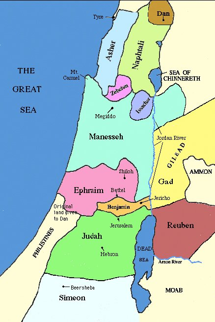
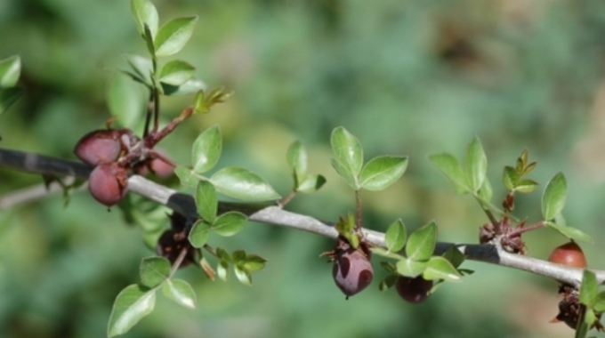

# Is there no Balm in Gilead

This question comes from the following verse in Jeremiah.

> 22 Is there no balm in Gilead; is there no physician there? why then is not the health of the daughter of my people recovered?

## Background

An aromatic spice used for healing wounds that was made from a bush grown in gilead. 

Here's a map of the geographical location of Gilead.

Here is also another picture of the bush used to create such the ointment refered to as the Balm in Gilead. These 

